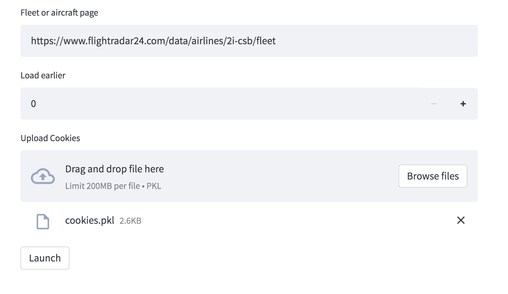

### ✈️ Scrape FlightRadar

**How-To Guide:**
This web GUI scrapes the tables in FlightRadar and outputs them as a downloadable Excel file.
Fill out the input fields, launch, wait for the scraping to finish, and finally click Download Result to save the outputs.
Please input a link for fleets (e.g. https://www.flightradar24.com/data/airlines/2i-csb/fleet) or aircraft (e.g. https://www.flightradar24.com/data/aircraft/n881yv). This automatically scrapes tables for all aircraft that can be found on these pages. Other links with tables will likely work, but each tab in the output may no longer be grouped by aircraft.

For Developers: This tool uses Selenium, BeautifulSoup, and Chrome for web scraping. Note that this runs as an anonymous user and will run into paywalls; please check out the [Github repo](https://github.com/g-luo/flightradar/blob/2b540ca93673fbddbb731efb159e808af5f4c5cd/streamlit_app.py#L139) for more information on authentication.

